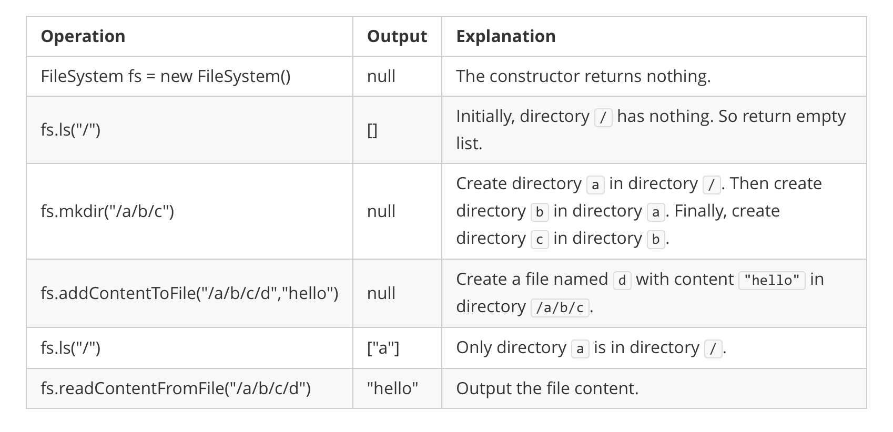

## 力扣之哈希表篇

在Java中, 最常使用的哈希表是`HashMap<KEY, VALUE>`. 其中`KEY`是键, `VALUE`是值, 也就是说`HashMap`保存的是`KEY/VALUE`键值对. 而每个`KEY`是独一无二的.

以下是示例代码:

```java
Map<String, Integer> map = new HashMap<>();
map.put("a", 1);
map.get("a");
```

这里要注意的是`HashMap`是内存数据结构, 也就是这个数据结构是在内存中存储的. 而`get`和`put`操作的时间复杂度都是$O(1)$.

如果我们的`HashMap`的`KEY`的数量是$N$个, 那么哈希表的空间复杂度可以近似认为是$O(N)$.

> 这里我们不会详细去研究哈希表的插入和查询操作的时间复杂度为什么是$O(1)$. 可以参阅相关数据结构教材.

### 力扣第1题: 两数之和

给定一个整数数组 `nums` 和一个整数目标值 `target`, 请你在该数组中找出 和为目标值 `target`  的那 两个 整数, 并返回它们的数组下标.

你可以假设每种输入只会对应一个答案. 但是, 数组中同一个元素在答案里不能重复出现.

你可以按任意顺序返回答案.

示例 1:

```
输入：nums = [2,7,11,15], target = 9
输出：[0,1]
解释：因为 nums[0] + nums[1] == 9 ，返回 [0, 1] 。
```

示例 2:

```
输入：nums = [3,2,4], target = 6
输出：[1,2]
```

示例 3:

```
输入：nums = [3,3], target = 6
输出：[0,1]
```

提示:

- <code>2 <= nums.length <= 10<sup>4</sup></code>
- <code>-10<sup>9</sup> <= nums[i] <= 10<sup>9</sup></code>
- <code>-10<sup>9</sup> <= target <= 10<sup>9</sup></code>
- 只会存在一个有效答案

### 力扣第359题: 日志速率限制器

请你设计一个日志系统, 可以流式接收消息以及它的时间戳. 每条 **不重复** 的消息最多只能每 10 秒打印一次. 也就是说, 如果在时间戳 `t` 打印某条消息, 那么相同内容的消息直到时间戳变为 `t + 10` 之前都不会被打印.

所有消息都按时间顺序发送. 多条消息可能到达同一时间戳.

实现 `Logger` 类:
- `Logger()` 初始化 `logger` 对象
- `bool shouldPrintMessage(int timestamp, string message)` 如果这条消息 `message` 在给定的时间戳 `timestamp` 应该被打印出来, 则返回 `true` , 否则请返回 `false` .

示例:

```
输入:
["Logger", "shouldPrintMessage", "shouldPrintMessage", "shouldPrintMessage", "shouldPrintMessage", "shouldPrintMessage", "shouldPrintMessage"]
[[], [1, "foo"], [2, "bar"], [3, "foo"], [8, "bar"], [10, "foo"], [11, "foo"]]
输出：
[null, true, true, false, false, false, true]

解释:
Logger logger = new Logger();
logger.shouldPrintMessage(1, "foo");  // 返回 true , 下一次 "foo" 可以打印的时间戳是 1 + 10 = 11
logger.shouldPrintMessage(2, "bar");  // 返回 true , 下一次 "bar" 可以打印的时间戳是 2 + 10 = 12
logger.shouldPrintMessage(3, "foo");  // 3 < 11 , 返回 false
logger.shouldPrintMessage(8, "bar");  // 8 < 12 , 返回 false
logger.shouldPrintMessage(10, "foo"); // 10 < 11 , 返回 false
logger.shouldPrintMessage(11, "foo"); // 11 >= 11 , 返回 true , 下一次 "foo" 可以打印的时间戳是 11 + 10 = 21
```

提示:
- <code>0 <= timestamp <= 10<sup>9</sup></code>
- 每个 `timestamp` 都将按非递减顺序(时间顺序)传递
- `1 <= message.length <= 30`
- 最多调用 <code>10<sup>4</sup></code> 次 `shouldPrintMessage` 方法

#### 解法

我们可以使用哈希表, 这样我们就能够保留队列中所有唯一的日志, 也能够快速判断日志的重复性.

> 这里利用了哈希表的`key`是独一无二的这一特性, 可以用来去重.

做法是用一个哈希表, 日志作为键, 时间戳作为值. 哈希表保留所有唯一的日志以及日志的最新时间戳.


从上面的例子可以看到, 哈希表中有一条记录, 日志 `m2` 和时间戳 `2`. 然后出现另一条日志 `m2`, 时间戳为 `15`. 由于日志是在 `13` 秒之前打印的(即超出时间范围), 因此它可以再次打印消息. 然后, 日志 `m2` 的时间戳将更新为 `15`.

算法:
- 我们初始化一个哈希表来记录日志到时间戳的映射.
- 新日志到达时, 条件如下时可以打印:
    - 我们以前从未见过这个日志.
    - 我们以前见过这条日志但是是在 `10` 多秒之前.
- 在上述两种情况下, 我们将更新哈希表中对应的日志的时间戮.

```java
class Logger {
    private HashMap<String, Integer> msgDict;

    /** 初始化哈希表 */
    public Logger() {
        msgDict = new HashMap<String, Integer>();
    }

    /**
    * 如果应该打印消息, 返回`true`. 不应该打印消息, 则返回`false`.
    */
    public boolean shouldPrintMessage(int timestamp, String message) {
        // 如果哈希表中不包含这条消息, 则将(消息 => 时间戳)键值对写入哈希表.
        if (!this.msgDict.containsKey(message)) {
            this.msgDict.put(message, timestamp);
            return true;
        }

        // 如果哈希表包含当前消息作为`key`
        // 取出这条消息的旧时间戳.
        Integer oldTimestamp = this.msgDict.get(message);
        // 如果当前消息的时间戳可以打印
        // 则更新哈希表, 然后返回`true`.
        if (timestamp - oldTimestamp >= 10) {
            this.msgDict.put(message, timestamp);
            return true;
        } else
            return false;
    }
}
```

在哈希表中即使日志过期, 我们也会保留所有日志. 这种特性可能会成为问题, 因为随着时间的推移, 内存的使用将继续增长. 有时, 需要考虑一下垃圾回收机制.

复杂度分析
- 时间复杂度: $O(1)$. 哈希表的查找和更新是常数的时间复杂度.
- 空间复杂度: $O(N)$, 其中 $N$ 是日志的数量. 随着时间的推移, 哈希表记录了每个出现过的唯一日志.

### 力扣第1166题: 设计文件系统

你需要设计一个文件系统, 你可以创建新的路径并将它们与不同的值关联.

路径的格式是一个或多个连接在一起的字符串, 形式为: `/` , 后面跟着一个或多个小写英文字母. 例如, `" /leetcode"` 和 `"/leetcode/problems"` 是有效路径, 而空字符串 `""` 和 `"/"` 不是.

实现 `FileSystem` 类:
- `bool createPath(string path, int value)` 创建一个新的 `path` , 并在可能的情况下关联一个 `value` , 然后返回 `true` . 如果路径已经存在或其父路径不存在, 则返回 `false` .
- `int get(string path)` 返回与 `path` 关联的值, 如果路径不存在则返回 `-1` .

示例 1:

```
输入： 
["FileSystem","create","get"]
[[],["/a",1],["/a"]]
输出： 
[null,true,1]
解释： 
FileSystem fileSystem = new FileSystem();

fileSystem.create("/a", 1); // 返回 true
fileSystem.get("/a"); // 返回 1
```

示例 2:

```
输入： 
["FileSystem","createPath","createPath","get","createPath","get"]
[[],["/leet",1],["/leet/code",2],["/leet/code"],["/c/d",1],["/c"]]
输出： 
[null,true,true,2,false,-1]
解释：
FileSystem fileSystem = new FileSystem();

fileSystem.createPath("/leet", 1); // 返回 true
fileSystem.createPath("/leet/code", 2); // 返回 true
fileSystem.get("/leet/code"); // 返回 2
fileSystem.createPath("/c/d", 1); // 返回 false 因为父路径 "/c" 不存在。
fileSystem.get("/c"); // 返回 -1 因为该路径不存在。
```

提示:
- 对两个函数的调用次数加起来小于等于 <code>10<sup>4</sup></code> 
- `2 <= path.length <= 100`
- <code>1 <= value <= 10<sup>9</sup></code>

#### 解法

`Linux`有一个 `tree` 命令, 根据这个命令我们可以很清晰的看到文件的目录结构:

```
.
├── b
│   └── f
├── c
└── e
```

很显然, 我们可以使用树结构记录文件的目录. 其实很多文件系统的设计都是使用树这个数据结构, 所以我们也可以使用树. 结构体存储当前路径的值和子路径的集合. 子路径的集合可以使用哈希表或者数组, 这里使用哈希表效率更高.

**算法**

我们用 `FileSystem` 结构来表示一个目录, `path` 成员是一个哈希表, 它保存该路径下的所有子目录, `value` 成员保存该目录对应的值.

`Create` 的时候根据 `/` 切割 `path`, 将其转换为数组, 得到整个路径的关系. 比如 `path = /a/b/c/d`, 切割之后的数组为 `["a", "b", "c", "d"]`, 其中 `a` 是根目录. 最后一个路径为 `d`, 我们首先要找到是否存在 `/a/b/c` 这个目录. 所以从 `a` 开始不断往下找, 直到找到 `c` 目录, 如果中间有个目录不存在, 返回 `false`, 否则, 看最后一个 `d` 目录是否存在, 若存在, 则说明整个路径已经存在, 返回 `false`, 否则新建一个目录并保存对应的值.

`Get` 的时候使用同样的方法依次按照目录的顺序判断是否存在, 如果中间有个目录不存在, 返回 `false`, 否则, 输出最后一个目录存储的值.

```java
public class FileSystem {
    public Map<String, FileSystem> pathMap = new HashMap<String, FileSystem>();
    public int value;

    public FileSystem() {
    }

    public FileSystem(int value) {
        this.value = value;
    }

    public boolean createPath(String path, int value) {
        if (path == "" || path == "/") return false;
        var paths = path.split("/");
        var m = this;
        for (int i = 1; i < paths.length - 1; i++) {
            var v = m.pathMap.get(paths[i]);
            if (v == null) return false;
            m = v;
        }
        var ok = m.pathMap.get(paths[paths.length - 1]);
        if (ok != null) return false;
        m.pathMap.put(
                paths[paths.length - 1],
                new FileSystem(value)
        );
        return true;
    }
    
    public int get(String path) {
        if (path == "" || path == "/") return -1;
        var paths = path.split("/");
        var m = this;
        for (int i = 1; i < paths.length - 1; i++) {
            var v = m.pathMap.get(paths[i]);
            if (v == null) return  -1;
            m = v;
        }
        var v = m.pathMap.get(paths[paths.length - 1]);
        if (v != null) return v.value;
        return -1;
    }
}
```

复杂度分析
- 时间复杂度: 总时间复杂度为 $O(mn)$, 其中 $n$ 为字符串 `path` 的长度, $m$ 为两个函数的总调用次数. `Create` 和 `Get` 的时间复杂度都为 $O(n)$, 切割字符串成数组 `paths` 需要遍历一次字符串, 复杂度为 $O(n)$, 遍历 `paths` 的总时间复杂度也为 $O(n)$.
- 空间复杂度: 最坏情况下, 所有操作均为`Create`, 并且每次都能新建一个路径, 即新增 $O(n)$ 的空间, 此时总空间复杂度为 $O(mn)$. `Create` 和 `Get` 各自的空间复杂度都为 $O(n)$, 其中 $n$ 为字符串 `path` 的长度, 即创建路径数组存储字符串所占空间.

## 力扣第588题: 设计内存文件系统

设计一个内存文件系统, 模拟以下功能:

实现文件系统类:

- `FileSystem()` 初始化系统对象
- `List<String> ls(String path)`
    - 如果 `path` 是一个文件路径, 则返回一个仅包含该文件名称的列表.
    - 如果 `path` 是一个目录路径, 则返回该目录中文件和 **目录名** 的列表.

答案应该 **按字典顺序** 排列.

- `void mkdir(String path)` 根据给定的路径创建一个新目录. 给定的目录路径不存在. 如果路径中的中间目录不存在, 您也应该创建它们.
- `void addContentToFile(String filePath, String content)`
    - 如果 `filePath` 不存在, 则创建包含给定内容 `content` 的文件.
    - 如果 `filePath` 已经存在, 将给定的内容 `content` 附加到原始内容.
- `String readContentFromFile(String filePath)` 返回 `filePath` 下的文件内容.

示例 1:



```
输入: 
["FileSystem","ls","mkdir","addContentToFile","ls","readContentFromFile"]
[[],["/"],["/a/b/c"],["/a/b/c/d","hello"],["/"],["/a/b/c/d"]]
输出:
[null,[],null,null,["a"],"hello"]

解释:
FileSystem fileSystem = new FileSystem();
fileSystem.ls("/");                         // 返回 []
fileSystem.mkdir("/a/b/c");
fileSystem.addContentToFile("/a/b/c/d", "hello");
fileSystem.ls("/");                         // 返回 ["a"]
fileSystem.readContentFromFile("/a/b/c/d"); // 返回 "hello"
```

注意:

- `1 <= path.length, filePath.length <= 100`
- `path` 和 `filePath` 都是绝对路径, 除非是根目录 `'/'` 自身, 其他路径都是以 `'/'` 开头且 **不** 以 `/` 结束.
- 你可以假定所有操作的参数都是有效的, 即用户不会获取不存在文件的内容, 或者获取不存在文件夹和文件的列表.
- 你可以假定所有文件夹名字和文件名字都只包含小写字母, 且同一文件夹下不会有相同名字的文件夹或文件.
- `1 <= content.length <= 50`
- `ls, mkdir, addContentToFile, and readContentFromFile` 最多被调用 `300` 次.

### 解法

我们使用一张哈希表来保存当前路径下所有的文件和子文件夹. 除此以外, 每个条目都有一个变量 `isfile`, 如果为 `true` 表示当前是一个文件, 否则是一个文件夹. 进一步的, 因为我们将文件夹和文件统一保存, 我们还需要一个 `content` 的条目, 如果 `isfile` 为 `true` 那么它保存了当前文件的内容. 对于子文件夹, `content` 为空.

下图说明了上面例子中的前 `2` 层文件结构.

```java
public class FileSystem {
    // 文件类
    class File {
        boolean isfile = false; // 是否是文件
        Map<String, File> files = new HashMap<>();
        String content = ""; // 文件的内容
    }
    // 根目录
    File root;
    // 实例化代码
    public FileSystem() {
        root = new File();
    }

    // `ls`命令的实现
    public List<String> ls(String path) {
        var t = root;
        var files = new ArrayList<String>();
        if (!path.equals("/")) {
            var d = path.split("/");
            for (int i = 1; i < d.length; i++) {
                t = t.files.get(d[i]);
            }
            // 如果`ls`的是文件, 则添加到`files`列表中.
            if (t.isfile) {
                files.add(d[d.length - 1]);
                return files;
            }
        }
        var res_files = new ArrayList<String>(t.files.keySet());
        Collections.sort(res_files);
        return res_files;
    }

    // `mkdir`命令的实现
    public void mkdir(String path) {
        var t = root;
        var d = path.split("/");
        for (int i = 1; i < d.length; i++) {
            if (!t.files.containsKey(d[i]))
                t.files.put(d[i], new File());
            t = t.files.get(d[i]);
        }
    }

    // 向文件添加内容
    public void addContentToFile(String filePath, String content) {
        var t = root;
        var d = filePath.split("/");
        for (int i = 1; i < d.length - 1; i++) {
            t = t.files.get(d[i]);
        }
        if (!t.files.containsKey(d[d.length - 1]))
            t.files.put(d[d.length - 1], new File());
        t = t.files.get(d[d.length - 1]);
        t.isfile = true;
        t.content = t.content + content;
    }

    // 从文件读取内容
    public String readContentFromFile(String filePath) {
        var t = root;
        var d = filePath.split("/");
        for (int i = 1; i < d.length - 1; i++) {
            t = t.files.get(d[i]);
        }
        return t.files.get(d[d.length - 1]).content;
    }
}
```

性能分析

- `ls` 的时间复杂度是 $O(m+n+klog(k))$. 这里 $m$ 是输入字符串的长度, 我们需要扫描输入字符串一次并获得每一层的文件名. $n$ 是最后一层文件夹的深度, 我们需要进入 $n$ 层的文件树以到达最后一层文件所在路径. $k$ 是最后一层的文件和文件夹总数目. 我们需要将它们排序, 所以需要 $k\log (k)$ 的时间.
- `mkdir` 时间复杂度是 $O(m+n)$, 这里 $m$ 是输入字符串的长度, $n$ 是最后一层文件夹的深度.
- `addContentToFile` 和 `readContentFromFile` 操作的时间复杂度都是 $O(m+n)$. $m$ 是输入字符串的长度, $n$ 是最后一层文件夹在文件树中的深度.
- 使用这种维护文件结构的优势是很容易添加更多指令. 比方说, `rmdir` 删除一个文件夹的指令只需要从列表中删除相应的条目.
- 重命名文件或者文件夹非常容易, 因为我们只需要以新名字创建一个新的文件夹结构或者文件并删除原本的条目即可.
- 从一个路径移动子文件夹到另一个路径也很容易, 因为我们需要做的只是获得相应子文件夹类的地址, 然后在新文件路径下赋新的值.
- 如果文件夹数目非常大, 我们会因为 `isfile` 和 `content` 浪费多余的空间.
- 这个方法的一个问题是如果我们只想要给定路径中文件夹的列表, 而不是文件的列表, 访问将会变得低效. 我们需要遍历当前文件夹所有内容一遍并检查是否是文件夹, 才能得到我们想要的数据.