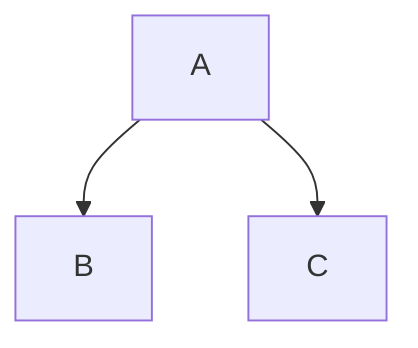

我们练习二叉树的题目, 主要是为了熟悉 **递归** 的编程方式.



## 第94题: 二叉树的中序遍历

给定一个二叉树的根节点 `root` , 返回它的 **中序** 遍历.

示例 1:

![[94-1.jpg]]

```
输入: root = [1,null,2,3]
输出: [1,3,2]
```

示例 2:

```
输入: root = []
输出: []
```

示例 3:

```
输入: root = [1]
输出: [1]
```

提示:
- 树中节点数目在范围 `[0, 100]` 内
- `-100 <= Node.val <= 100`

进阶: 递归算法很简单, 你可以通过迭代算法完成吗?

## 力扣第226题: 翻转二叉树

给你一棵二叉树的根节点 `root` , 翻转这棵二叉树, 并返回其根节点.

示例 1:


```
输入: root = [4,2,7,1,3,6,9]
输出: [4,7,2,9,6,3,1]
```

示例 2:


```
输入: root = [2,1,3]
输出: [2,3,1]
```

示例 3:

```
输入: root = []
输出: []
```

提示:
- 树中节点数目范围在 `[0, 100]` 内
- `-100 <= Node.val <= 100`

### 解法

```java
/**
 * Definition for a binary tree node.
 * public class TreeNode {
 *     int val;
 *     TreeNode left;
 *     TreeNode right;
 *     TreeNode() {}
 *     TreeNode(int val) { this.val = val; }
 *     TreeNode(int val, TreeNode left, TreeNode right) {
 *         this.val = val;
 *         this.left = left;
 *         this.right = right;
 *     }
 * }
 */
class Solution {
    public TreeNode invertTree(TreeNode root) {
        if (root != null) {
            var tmp = root.left;
            root.left = invertTree(root.right);
            root.right = invertTree(tmp);
        }
        return root;
    }
}
```

## 力扣第104题: 二叉树的最大深度

给定一个二叉树, 找出其最大深度.

二叉树的深度为根节点到最远叶子节点的最长路径上的节点数.

**说明:** 叶子节点是指没有子节点的节点.

**示例:**  
给定二叉树 `[3,9,20,null,null,15,7]`,

```
    3
   / \
  9  20
    /  \
   15   7
```

返回它的最大深度 3 .

### 解法

```java
/**  
 * Definition for a binary tree node.
 * public class TreeNode {
 *     int val;
 *     TreeNode left;
 *     TreeNode right;
 *     TreeNode() {}
 *     TreeNode(int val) { this.val = val; }
 *     TreeNode(int val, TreeNode left, TreeNode right) {
 *         this.val = val;
 *         this.left = left;
 *         this.right = right;
 *     }
 * }
 */
class Solution {  
    public int maxDepth(TreeNode root) {  
        if (root != null) {  
            return Math.max(1 + maxDepth(root.left), 1 + maxDepth(root.right));  
        }  
        return 0;  
    }  
}
```