## 算法基础

### 算法是什么?

非形式化地说, 算法(algorithm)就是任何经过良好定义的计算过程, 这个过程取某个值或值的集合作为输入并在有限的时间内产生某个值或值的集合作为输出. 这样算法就是把输入转换成输出的计算步骤的一个序列.

**快速排序作为算法的一个例子**



**编译器作为算法的一个例子**



**GPT模型作为算法的一个例子**


### 算法需要满足的条件

- 在合理的时间内运行结束. 一个排序执行1年不太合适.
- 不能占用太大的空间, 一个排序占用1T内存不太合适.

### 为什么要学习算法?

- 计算机科学所有分支学科的核心都是算法
- 顶尖工程师一定精通算法
- 学好算法是成为一名优秀的工程师的必要条件

### 一些应用场景举例

- 操作系统内核:
  - 各种链表的使用
  - 红黑树(epoll)
  - 环形缓冲区
  - ...
- 编译器
  - 有限状态机
  - 树(抽象语法树)
  - 图论(寄存器分配)
  - 垃圾收集(深度优先搜索)
  - ...
- 数据库
  - B+树(MySQL索引)
  - 图论(执行计划的优化)
  - 树形结构(抽象语法树)
  - ...
- TCP-IP协议
  - 有限状态机(三次握手的流程)
  - 滑窗算法(流量控制和乱序重排)
  - ...
- 分布式系统
  - Paxos算法(zookeeper, etcd, ...)
  - 工作量证明(比特币)
  - ...
- GPT模型
  - 反向传播算法(动态规划+链式求导)
  - 多层感知机
  - Transformer模型
  - ...

### 程序的性能分析

- 时间复杂度: 主要分析一个程序需要执行多长时间
- 空间复杂度: 主要分析一个程序需要使用多少内存

> 程序执行多长时间说的更加精确一些应该是: 需要多少个**时间单位**
>
> 程序的空间复杂度, 我们一般分析内存的占用情况, 磁盘之类的外存一般不考虑

### 为什么要分析程序的性能?

- CPU可能很快, 但不是无限快
- 内存和磁盘可能很便宜, 但并不是无限大和不要钱的
- 解决同样的问题, 一个好的算法比一个不好的算法需要的时间少得多

> 例如: 一个已经排序好的包含1亿个元素的数组, 要查找1个元素是否在数组中, 使用线性查找算法(也就是从头到尾遍历数组去查找这个元素), 如果碰到最坏的情况(待查找元素不在数组中), 那么需要花费1亿个时间单位才能发现元素不在数组中. 如果使用二分查找算法, 那么碰到最坏的情况, 只需要$\log_2(1,0000,0000)\approx 27$次就可以得出元素不在数组中的结论.

### 程序性能是基于什么样的计算机模型来说的?

- 肯定不能是量子计算机模型.
- 我们使用简单的通行的冯诺依曼-图灵架构.

### 我们选用的冯诺依曼架构的特点

- 单核(只有1个CPU)
- CPU的指令一条接着一条的按顺序执行(不存在并行执行)
- CPU的指令集只包含简单的指令
  - 算术指令: 加法, 减法, 乘法, 除法, 取余, 向下取整, 向上取整
  - 数据移动指令: 加载, 存储, 复制
  - 控制指令: 条件与无条件转移, 子程序调用与返回
  - 每条这样的指令所需时间都为常量(一个时间单位)
  - 没有排序指令, 矩阵相乘指令这样的神奇指令
- 内存是随机存取器(Random Access Memory, RAM)
- 内存是一个巨大的字节数组
- 使用索引读写内存中的某个字节例如: `a[1] = 1;`, 花费常量时间(1个时间单位)

假设我们的CPU是8位的, 那么寻址空间(也就是索引字节数组的大小)是$0\sim 255$. 换成十六进制表示则是$0x00 \sim 0xFF$. 如下图所示:



### 时间复杂度

我们一般假设一段程序的时间复杂度(运行时间)是$T(N)$, $N$表示程序的输入规模(例如数组的大小, 大整数的位数等等). 那么$T(N)$一般求得的结果我们使用**大$O$表示法**来表示. 我们通过举例子的方式来看一下大$O$表示法是什么东西.

> 大$O$表示法是最常用的, 时间复杂度的分析其实涉及很深的数学知识, 有大$O$表示法, 大$\Theta$表示法, 大$\Omega$表示法等等. 但这里为了方便理解, 我们只讲大$O$表示法, 并将它通俗化.

**常数时间**$O(1)$

> 表示只使用1个时间单位.

```java
int f() {
    return 1;
}
```

假设方法`f`的时间复杂度是$T$, 由于`return 1`返回语句只需要1个时间单位, 所以`f`的时间复杂度是$T=O(1)$.

```java
int f() {
    int a = 1;
    return a;
}
```

两条语句的时间复杂度都是$O(1)$, 而$O(1) + O(1) = 2O(1) = O(1)$. 这个等式可能有些奇怪, 但没有问题. 因为大$O$表示法本身是时间复杂度的一个大概估计(精确分析非常困难且没有必要). 所以我们一般舍弃低阶项和常数系数. 例如: $O(2N) = O(N)$, $O(N)+O(N^2)=O(N^2)$等等.

列举一些常用的常数时间复杂度的代码:

- `int a = 1`: 赋值需要1个时间单位, 所以是$O(1)$.
- `i++`: 等价于`i = i + 1`, 加法操作需要$O(1)$, 赋值操作需要$O(1)$. 所以$O(1) + O(1) = 2O(1) = O(1)$. 这里忽略了系数.
- `i > j`: 比较操作需要$O(1)$.
- `return a + b`: 加法操作需要$O(1)$, `return`需要$O(1)$, 所以这个`return`语句是$O(1)$.

**线性时间**$O(N)$

> 表示使用$N$个时间单位

```java
int search(int[] nums, int target) {
    int N = nums.length;
    for (int i = 0; i < N; i++) {
        if (nums[i] == target) return i;
    }
    return -1;
}
```

假设方法`search`的时间复杂度是$T(N)$, 我们分析最坏情况, 也就是`target`不在数组中的情形, 我们逐行分析:

- 第2行: 获取数组长度需要$O(1)$, 赋值需要$O(1)$, 两者相加, 时间复杂度是$O(1)$.
- 第3行: `for`循环的括号中的3个语句(每个语句执行一次时间复杂度都是$O(1)$), 我们分别来看一下时间复杂度是多少. `int i = 0`只执行1次, 时间复杂度是$O(1)$. `i < N`执行了$N+1$次. `i++`执行了$N$次. 所以时间复杂度是: $O(1) + (N+1)\cdot O(1) + N\cdot O(1) = O(2N + 2) = O(N)$.
- 第4行: 由于是最坏情况, 所以每轮循环执行一次条件检测`nums[i] = target`, 时间复杂度是$O(1)$. 一共执行了$N$轮循环. 所以时间复杂度是$N\cdot O(1)=O(N)$.
- 第6行: 时间复杂度是$O(1)$.

把每一行代码所用的时间加起来得到
$$
\begin{equation*}
\begin{aligned}
T(N) &= O(1) + O(N) + O(N) + O(1) \\
     &= O(2N + 2) \\
     &= O(N)
\end{aligned}
\end{equation*}
$$
所以方法`search`的时间复杂度是$O(N)$, 也就是线性时间复杂度.

**平方时间**$O(N^2)$

```java
void f(int N) {                                 // 代价     次数
    for (int i = 0; i < N; i++) {               // O(1)     N
        for (int j = 0; j < N; j++) {           // O(1)     N*N
            System.out.println("hello world");  // O(1)     N*N
        }
    }
}
```

这段代码的时间复杂度如何计算?

$$
\begin{aligned}
T(N) &= O(1) + O(N^2) + O(N^2) \\
     &= O(2N^2 + 1) \\
     &= O(N^2)
\end{aligned}
$$


**对数时间**$O(\log{N})$

这里的符号$\log{N}$实际上是$\log_2N$. 因为在计算机中, 不明确说明对数都是**以2为底**的.

通常情况下, 当我们将一个问题分割为**完全不重合**的子问题时, 时间复杂度就会出现对数时间.

我们举个**递归实现的二分查找**的例子.

> 二分查找要解决的问题是在已经升序排列的数组中寻找某个特定元素的问题.

```java
int search(int[] array, int target, int left, int right) {
    if (left <= right) {                                     // O(1)
        int mid = (left + right) / 2;                        // O(1)
        if (array[mid] == target) {                          // O(1)
            return mid;                                      // 最坏情况执行不到这里
        } else if (array[mid] < target) {                    // O(1)
            return search(array, target, mid + 1, right);    // T(N/2)
        } else {
            return search(array, target, left, mid - 1);     // T(N/2)
        }
    }
    
    return -1;                                               // O(1)
}
```

上面是递归实现的二分查找算法. 我们来考虑最坏情况下的时间复杂度, 而最坏情况就是要查找的元素`target`不在数组`array`里面.

我们假设上面方法的时间复杂度是$T(N)$. $N$是`array`数组的长度. 由于方法体中的递归调用针对的是砍掉一半的数组, 所以第7行和第9行的时间复杂度分别是$T(N/2)$. 而第7行和第9行的递归调用每次只会调用其中一个. 所以时间复杂度的推导公式可以得到
$$
\begin{aligned}
T(1) &= O(1) \\
T(N) &= T(N/2) + O(1)
\end{aligned}
$$
为了方便推导, 我们假设$N=2^M$. 我们先来复习一下替换法则, 根据上面的公式可以得到
$$
T(N/2) = T(N/4) + O(1)
$$

$$
T(N/4) = T(N/8) + O(1)
$$

我们开始推导
$$
\begin{equation*}
\begin{aligned}
T(N) &= T(\frac{N}{2}) + O(1) \\
     &= T(\frac{N}{2^2}) + 2O(1) \\
     &= T(\frac{N}{2^3}) + 3O(1) \\
     &= \cdots \\
     &= T(\frac{N}{2^M}) + MO(1) \\
     &= T(1) + MO(1) \\
     &= (M+1)O(1) \\
     &= MO(1) \\
     &= O(M) \\
     &= O(\log N)
\end{aligned}
\end{equation*}
$$
上面公式要注意的是: $T(1) = O(1)$. 为什么呢? 因为如果数组只有1个元素, 那么我们只需要$O(1)$的时间就可以确定待查找元素是否在数组中. 还要注意的一点是: $MO(1)=O(M)$. 这个很好理解.

**线性对数时间**$O(N\log N)$

我们以归并排序为例

```java
// 这里我们不给出Merge(合并)操作的具体代码,
// 只需要知道Merge的时间复杂度是O(N)就可以了.
void Merge(int[] array, int left, int mid, int right) {
    ...
}

// 归并排序的主程序, 时间复杂度设为T(N)
void MergeSort(int[] array, int left, int right) {
    if (left <= right) {                   // O(1)
        int mid = (left + right) / 2;      // O(1)
        MergeSort(array, left, mid);       // T(N/2)
        MergeSort(array, mid+1, right);    // T(N/2)
        Merge(array, left, , mid, right);  // O(N)
    }
}
```

将归并排序的主程序的每一行的时间复杂度都加起来, 可得
$$
T(N) = 2T(N/2) + O(N)
$$
我们还是假设$N=2^M$. 推导过程如下
$$
\begin{equation*}
\begin{aligned}
T(N) &= 2T(N/2) + O(N) \\
     &= 2(2T(N/4) + O(N/2)) + O(N) \\
     &= 4T(N/4) + 2O(N) \\
     &= 8T(N/8) + 3O(N) \\
     &= 2^3T(\frac{N}{2^3}) + 3O(N) \\
     &= \cdots \\
     &= 2^MT(\frac{N}{2^M}) + MO(N) \\
     &= NT(1) + \log NO(N) \\
     &= (\log N + 1)O(N) \\
     &= \log N\cdot O(N) \\
     &= O(N\log N)
\end{aligned}
\end{equation*}
$$
**指数时间**$O(2^N)$

斐波那契数列的通项公式如下
$$
Fib(N)=
\begin{cases}
0\quad &如果N=0 \\
1\quad &如果N=1 \\
Fib(N-1) + Fib(N-2)\quad &如果N\geq 2
\end{cases}
$$
转换成代码如下

```java
long Fib(int N) {
    if (N == 0 || N == 1) return N;
    else return Fib(N-1) + Fib(N-2);
}
```

而时间复杂度的分析和通项公式是一致的. 假设调用`Fib(N)`的时间复杂度是$T(N)$. 则递归调用`Fib(N-1)`的时间复杂度是$T(N-1)$, 同理`Fib(N-2)`的时间复杂度是$T(N-2)$. 于是有如下
$$
\begin{equation*}
\begin{aligned}
T(0) &= O(1) \\
T(1) &= O(1) \\
T(N) &= T(N-1) + T(N-2) + O(1)
\end{aligned}
\end{equation*}
$$
上面的式子看起来很难推导. 我们这里使用数学归纳法来解决这个问题. 首先我们假设$T(N-1)=O(2^{N-1})$. 对于$T(0)和T(1)$显然是成立的(**基准情况**). 那么递推公式就变成了
$$
\begin{aligned}
T(N) &= O(2^{N-1}) + O(2^{N-2}) + O(1) \\
     &= O(\frac{3}{4}\cdot 2^N) + O(1) \\
     &= O(2^N)
\end{aligned}
$$
这样我们就证明了$T(N)=O(2^N)$. 可以看出我们的程序的运行时间是指数时间.

### 算法的正确性

我们上面讲了如何粗糙地分析一个算法的性能. 现在我们来讲一下算法的正确性. 也就是说, 我们设计一个算法出来之后, 如何知道这个算法是否正确? 现在最常用的方式是**测试**, 也就是通过输入几个测试用例看看输出是否正确. 但这种方式只能说明对输入的测试用例, 算法的工作没有问题. 并不能说明对于所有的输入算法都能正确运行. 因为测试用例只能尽可能的覆盖输入, 而无法全部覆盖.

所以一些很关键的算法, 可能就需要使用形式化的方法来证明这个算法的正确性了. 这里我们使用的形式化方法叫做**循环不变量**(loop invariant).

#### 常用证明手段

##### 数学归纳法

数学归纳法的思路是先对 **基准条件** 证明定理为真, 再对 **归纳假设** 证明定理为真即可.

**定理**: 对所有的$n\in \N$,
$$
\sum_{i=1}^ni = 1 + 2 + 3 + \cdots + n = \frac{n(n+1)}{2}
$$
**证明**:

- **基准条件**. 对于$n=1$时, 公式显然成立.
- **归纳假设**. 假设对于$n$公式成立, 需要证明公式对$n+1$成立.

$$
\begin{aligned}
\sum_{i=1}^{n+1}i &= 1 + 2 + 3 + \cdots + n + (n + 1) \\
                  &= \frac{n(n+1)}{2} + (n+1) \\
                  &= \frac{(n+1)(n+2)}{2}
\end{aligned}
$$

定理得证.

##### 反证法

反证法的思路是先假设定理不成立, 然后证明假设是错误的.

**定理**: $\sqrt{2}$是无理数.

**证明**: 首先我们知道 **任何有理数都可以表示为两个整数的商**. 假设$\sqrt{2}$是有理数. 我们可以将$\sqrt 2$最简分数形式(分子分母没有公约数), 即$\sqrt 2 = n/d$, $n$和$d$是整数且没有公约数. 两边同时平方, 得到$2=n^2/d^2 \to 2d^2=n^2$. 所以可以知道$n$是$2$的倍数. 所以$n^2$一定是$4$的倍数. 所以$2d^2$一定是$4$的倍数. 那么$d^2$一定是$2$的倍数. 那么$d$一定是$2$的倍数. $d$和$n$都有约数$2$, 和假设矛盾. 所以定理得证.

#### 循环不变量

循环**不变量**是在每个循环迭代的开始和结束时为真的条件, 当我们编写一个可以正常工作的循环时, 至少隐含地依赖了一个循环不变量. 了解什么是循环不变量并明确地思考循环不变量将帮助我们编写正确且高效的代码来实现棘手的算法.

我们以**迭代实现的二分查找**为例子来看一下, 为了方便讲解, 我们的**前置条件**保证要寻找的`target`一定在数组`array`中. 我们这个二分查找有以下几个前置条件:

- 数组升序排列.
- 数组中的元素都不一样.
- 寻找的目标`target`一定在数组`array`中.

```java
int IterativeBinarySearch(int[] array, int target) {
    int left = 0;
    int right = array.length - 1;
    while (left <= right) {
        int mid = (left + right) / 2;
        if (target > array[mid]) {
            left = mid + 1;
        } else if (target < array[mid]) {
            right = mid - 1;
        } else if (target == array[mid]) {
            assert(left <= right);
            return mid;
        }
        assert(left <= right);
    }
    return -1; // 未找到, 这里为了保证语法正确. 因为我们已经知道`target`一定在`array`中.
}
```

从概念上讲, 这个算法很简单. 但是要完全正确编写代码是很棘手的. 我们怎么知道我们得到了正确的计算`mid`? 为什么是`target < array[mid]`? 为什么`left = mid + 1`以及`right = mid -1`? 如果我们改变这些决定中的任何一个, 算法都可能无法找到正确的元素.

为了说服我们自己编写的是正确的代码, 我们需要一个包含三个子句的循环不变量:

> 找到一个循环的循环不变量是一件不太容易的事情.

1. $array$是升序排列.
2. $left \leq right$.
3. $target \in array[left..right]$.

如果我们知道一个循环的循环不变量, 作为文档记录下来是个好主意. 我们甚至可以以加断言`assert`的方式来作为文档. 也就是在每次循环执行时执行断言. 我在代码里就添加了一些断言.

**使用循环不变量来证明代码是正确的**

循环不变量可以帮助我们说服自己, 我们的代码, 尤其是棘手的代码, 是正确的. 它们可以帮助我们开发出正确的代码, 帮助我们编写高效的代码.

要使用循环不变量来论证代码执行我们想要的操作, 我们使用以下步骤:

1. **初始化**. 循环的第一次迭代之前, 循环不变量为真.
2. **保持**. 证明如果假设了循环的某次迭代之前循环不变量为真, 那么下次迭代之前循环不变量仍为真.
3. **终止**. 在循环终止时, 循环不变量为我们提供一个有用的性质. 这个性质有助于证明算法是正确的.

> 这个过程类似数学归纳法. 初始化是基准条件, 保持是归纳假设, 终止要说明我们这个循环一定会结束, 不是死循环.

让我们在二分查找算法上尝试这三个步骤.

1. **初始化**. 首先证明在第一次循环迭代之前, 循环不变量成立. 循环不变量包含三个部分:

   1. 数组升序排序, 这是我们的前置条件所保证的.
   2. 由于$array.length$至少为1, 因此$left\leq right$.
   3. $target$在$array[left..right]$中, 因为那是整个数组, 我们的前置条件保证$target$在数组里面.

   这表明在第一次循环迭代之前循环不变量成立.

2. **保持**. 由于我们代码中没有对数组做任何更改, 所以循环不变量(1)一直成立. 我们主要看循环不变量(2)和循环不变量(3)的证明. 我们先来看循环不变量(2): $left\le right$. 如果某一轮循环执行之前, 有$left\le right$成立, 我们需要证明这轮循环结束时, 也成立. 也就是第11行和第13行代码的断言成立. 由于前置条件保证了$target\in array[left..right]$, 所以一定只有以下三种情况:

   1. $target\in array[left..mid-1]$. 如果落到这个情况, 也就是第8行的条件为真, 那么本轮循环结束时, 有$left$不变, $right=mid-1$. 显然有$left<=mid-1=right$.
   2. $target\in array[mid+1..right]$. 分析同上.
   3. $target==array[mid]$. 此时直接退出循环, $left$和$right$都没变. 所以也成立.

   而且可以看到, 对于以上三种情况, 循环不变量(3)在每轮循环结束也是成立的.

3. **终止**. 我们的算法一定会终止吗? 这一点非常重要. 如果某一轮循环中有$target==array[mid]$成立, 那么我们找到了元素, 且直接`return`. 这种情况下循环就终止了. 而在没找到目标之前的每轮循环中, 要么$left=mid+1$, 要么$right=mid-1$. 也就是搜索数组的范围一直在缩小. 最坏情况下, 会一直缩小到搜索范围中只有一个元素, 也就是$left=right$的情况. 而由于我们的前置条件保证了目标一定在数组中, 所以这个元素就是目标. 而根据保持阶段的论证, 最后一轮循环结束时, 循环不变量也是成立的.

至此迭代式二分查找算法的正确性得到了证明. 我们可以放心使用了.

## 力扣之二分思想篇

所谓的二分思想, 根据我们之前讲的二分查找算法, 其实就是在程序执行过程中, 尽量快速的排除掉没用的数据. 例如我们在寻找程序bug的时候, 可以尝试先删除一半的代码, 如果程序能正常执行, 那么bug可能在删除的代码中, 如果还有bug, 那么bug就在留下的这一半代码中. 依次类推.

### 力扣第704题: 二分查找

使用我们上一节的算法可以直接通过.

```java
class Solution {
    public int search(int[] nums, int target) {
        int left = 0;
        int right = nums.length - 1;
        while (left <= right) {
            int mid = (left + right) / 2;
            if (target < nums[mid]) {
                right = mid - 1;
            } else if (target > nums[mid]) {
                left = mid + 1;
            } else {
                return mid;
            }
        }

        return -1;
    }
}
```

如果我们要在数组$[1,2,3,4,5,6,7,8]$中寻找$9$这个数. 那么最终会返回$-1$. 每轮循环如下:

- 循环开始前搜索范围是:$[1,2,3,4,5,6,7,8]$
- 第一轮循环结束后搜索范围是:$[5,6,7,8]$.
- 第二轮循环结束后搜索范围是:$[7,8]$.
- 第三轮循环结束后搜索范围是:$[8]$.
- 第四轮循环结束后$left > right$. 循环退出.

也就是说在**最坏情况下**(也就是找不到目标元素), 每轮循环都砍去一半的搜索范围, 如果数组的大小$N=2^M$. 那么大概$M$轮循环之后, 就循环退出了. 所以循环执行次数是$M=\log N$次. 而每轮循环的时间复杂度是$O(1)$. 所以迭代式二分查找的时间复杂度是$O(\log N)$. 且我们需要的额外空间是几个局部变量, 所以空间复杂度是$O(1)$.

### 力扣第35题: 搜索插入位置

给定一个排序数组和一个目标值, 在数组中找到目标值, 并返回其索引. 如果目标值不存在于数组中, 返回它将会被按顺序插入的位置.

请必须使用时间复杂度为$O(\log N)$的算法.

示例 1:

```
输入: nums = [1,3,5,6], target = 5
输出: 2
```

示例 2:

```
输入: nums = [1,3,5,6], target = 2
输出: 1
```

示例 3:

```
输入: nums = [1,3,5,6], target = 7
输出: 4
```

提示:
- 1 <= nums.length <= 10<sup>4</sup>
- -10<sup>4</sup> <= nums[i] <= 10<sup>4</sup>
- nums 为 **无重复元素** 的 **升序** 排列数组
- -10<sup>4</sup> <= target <= 10<sup>4</sup>

#### 二分解法

```java
class Solution {
    public int searchInsert(int[] nums, int target) {
        int left = 0;
        int right = nums.length - 1;
        while (left <= right) {
            int mid = (left + right) / 2;
            if (target < nums[mid]) {
                right = mid - 1;
            } else if (target > nums[mid]) {
                left = mid + 1;
            } else {
                return mid;
            }
        }
        // 如果执行到这里, 那么有left == right + 1
        // 我们寻找插入位置
        if (left == nums.length) return left;
        if (right == -1) return 0;
        return left;
    }
}
```

### 力扣第74题: 搜索二维矩阵

编写一个高效的算法来判断 m x n 矩阵中, 是否存在一个目标值. 该矩阵具有如下特性:
- 每行中的整数从左到右按升序排列.
- 每行的第一个整数大于前一行的最后一个整数.

示例1:


```
输入: matrix = [[1,3,5,7],[10,11,16,20],[23,30,34,60]], target = 3
输出: true
```

示例2:


```
输入: matrix = [[1,3,5,7],[10,11,16,20],[23,30,34,60]], target = 13
输出: false
```

提示:
- $m == matrix.length$
- $n == matrix[i].length$
- $1 \le m, n \le 100$
- $-10^4 \le matrix[i][j], target \le 10^4$

#### 二分思路

```java
class Solution {
    public boolean searchMatrix(int[][] matrix, int target) {
        int m = matrix.length;
        int n = matrix[0].length;
        int i = 0;
        int j = n - 1;
        while (i < m && j >= 0) {
            if (matrix[i][j] == target) {
                return true;
            } else if (matrix[i][j] < target) {
                i++;
            } else {
                j--;
            }
        }

        return false;
    }
}
```

### 力扣第34题: 在排序数组中查找元素的第一个和最后一个位置

给你一个按照非递减顺序排列的整数数组 nums, 和一个目标值 target. 请你找出给定目标值在数组中的开始位置和结束位置.

如果数组中不存在目标值 target, 返回 [-1, -1].

你必须设计并实现时间复杂度为 $O(\log N)$ 的算法解决此问题.

示例 1:

```
输入: nums = [5,7,7,8,8,10], target = 8
输出: [3,4]
```

示例 2:

```
输入: nums = [5,7,7,8,8,10], target = 6
输出: [-1,-1]
```

示例 3:

```
输入: nums = [], target = 0
输出: [-1,-1]
```

提示:
- $0 \le nums.length \le 10^5$
- $-10^9 \le nums[i] \le 10^9$
- nums 是一个非递减数组
- $-10^9 \le target \le 10^9$

#### 二分解法

```java
class Solution {
    public int[] searchRange(int[] nums, int target) {
        int left = 0;
        int right = nums.length - 1;
        int[] result = {-1, -1};
        while (left <= right) {
            int mid = (left + right) / 2;
            if (target < nums[mid]) {
                right = mid - 1;
            } else if (target > nums[mid]) {
                left = mid + 1;
            } else {
                int i = mid;
                int j = mid;

                while (i >= 0 && nums[i] == target) i--;
                while (j < nums.length && nums[j] == target) j++;

                result[0] = i + 1;
                result[1] = j - 1;
                return result;
            }
        }

        return result;
    }
}
```

### 力扣第33题: 搜索旋转排序数组

整数数组 `nums` 按升序排列, 数组中的值 **互不相同** .

在传递给函数之前, `nums` 在预先未知的某个下标 `k(0 <= k < nums.length)` 上进行了 **旋转**, 使数组变为 `[nums[k], nums[k+1], ..., nums[n-1], nums[0], nums[1], ..., nums[k-1]]`(下标 从 0 开始 计数). 例如, `[0,1,2,4,5,6,7]` 在下标 3 处经旋转后可能变为 `[4,5,6,7,0,1,2]` .

给你 **旋转后** 的数组 `nums` 和一个整数 `target` , 如果 `nums` 中存在这个目标值 `target` , 则返回它的下标, 否则返回 -1 .

你必须设计一个时间复杂度为 $O(\log N)$ 的算法解决此问题.

示例 1:

```
输入：nums = [4,5,6,7,0,1,2], target = 0
输出：4
```

示例 2:

```
输入: nums = [4,5,6,7,0,1,2], target = 3
输出: -1
```

示例 3:

```
输入: nums = [1], target = 0
输出: -1
```


提示:
- `1 <= nums.length <= 5000`
- <code>-10<sup>4</sup> <= nums[i] <= 10<sup>4</sup></code>
- `nums` 中的每个值都 **独一无二**
- 题目数据保证 `nums` 在预先未知的某个下标上进行了旋转
- <code>-10<sup>4</sup> <= target <= 10<sup>4</sup></code>

#### 二分解法

```java
class Solution {
    public int search(int[] nums, int target) {
        int left = 0;
        int right = nums.length - 1;
        while (left <= right) {
            int mid = (left + right) / 2;
            if (target == nums[mid]) {
                return mid;
            }
            if (nums[left] <= nums[mid]) {
                if (target < nums[mid] && target >= nums[left]) {
                    right = mid - 1;
                } else {
                    left = mid + 1;
                }
            } else if (nums[right] > nums[mid]) {
                if (target > nums[mid] && target <= nums[right]) {
                    left = mid + 1;
                } else {
                    right = mid - 1;
                }
            }
        }

        return -1;
    }
}
```

### 力扣第153题: 寻找旋转排序数组中的最小值

已知一个长度为 `n` 的数组, 预先按照升序排列, 经由 `1` 到 `n` 次 旋转 后, 得到输入数组. 例如, 原数组 `nums = [0,1,2,4,5,6,7]` 在变化后可能得到:

- 若旋转 4 次, 则可以得到 `[4,5,6,7,0,1,2]`
- 若旋转 7 次, 则可以得到 `[0,1,2,4,5,6,7]`

注意, 数组 `[a[0], a[1], a[2], ..., a[n-1]]` 旋转一次 的结果为数组 `[a[n-1], a[0], a[1], a[2], ..., a[n-2]]` .

给你一个元素值 互不相同 的数组 `nums` , 它原来是一个升序排列的数组, 并按上述情形进行了多次旋转. 请你找出并返回数组中的 **最小元素** .

你必须设计一个时间复杂度为 $O(\log N)$ 的算法解决此问题.

示例 1:

```
输入: nums = [3,4,5,1,2]
输出: 1
解释: 原数组为 [1,2,3,4,5] , 旋转 3 次得到输入数组.
```

示例 2:

```
输入: nums = [4,5,6,7,0,1,2]
输出: 0
解释: 原数组为 [0,1,2,4,5,6,7] , 旋转 4 次得到输入数组.
```

示例 3:

```
输入: nums = [11,13,15,17]
输出: 11
解释: 原数组为 [11,13,15,17] , 旋转 4 次得到输入数组.
```

提示:

- `n == nums.length`
- `1 <= n <= 5000`
- `-5000 <= nums[i] <= 5000`
- `nums` 中的所有整数 **互不相同**
- `nums` 原来是一个升序排序的数组, 并进行了 `1` 至 `n` 次旋转

#### 二分解法

```java
class Solution {
    public int findMin(int[] nums) {
        int left = 0;
        int right = nums.length - 1;
        while (left < right && nums[left] > nums[right]) {
            int mid = (left + right) / 2;
            if (nums[mid] < nums[right]) {
                right = mid;
            } else {
                left = mid + 1;
            }
        }

        return nums[left];
    }
}
```

### 力扣第4题: 寻找两个正序数组的中位数

给定两个大小分别为 `m` 和 `n` 的正序(从小到大)数组 `nums1` 和 `nums2`. 请你找出并返回这两个正序数组的 **中位数** .

算法的时间复杂度应该为 $O(\log (m+n))$ .

示例 1:

```
输入: nums1 = [1,3], nums2 = [2]
输出: 2.00000
解释: 合并数组 = [1,2,3] ，中位数 2
```

示例 2:

```
输入: nums1 = [1,2], nums2 = [3,4]
输出: 2.50000
解释: 合并数组 = [1,2,3,4] , 中位数 (2 + 3) / 2 = 2.5
```

提示:

- `nums1.length == m`
- `nums2.length == n`
- `0 <= m <= 1000`
- `0 <= n <= 1000`
- `1 <= m + n <= 2000`
- <code>-10<sup>6</sup> <= nums1[i], nums2[i] <= 10<sup>6</sup></code>

#### 解法

这道题我们可以一下就想到, 先将两个数组合并成一个数组, 然后对合并后的数组进行排序, 然后计算中位数. 这个方法一定可行, 可惜不满足题目要求的时间复杂度. 不过我们还是给出代码.

```java
class Solution {
    public double findMedianSortedArrays(int[] nums1, int[] nums2) {
        int[] nums = new int[nums1.length + nums2.length];

        for (int i = 0; i < nums1.length; i++) {
            nums[i] = nums1[i];
        }

        for (int j = 0; j < nums2.length; j++) {
            nums[nums1.length + j] = nums2[j];
        }

        Arrays.sort(nums);

        if (nums.length % 2 == 1) return nums[nums.length / 2];
        else return (nums[nums.length / 2] + nums[nums.length / 2 - 1]) / 2.0;
    }
}
```

> 这道题本身是《算法导论》的一道课后习题, 难度非常大. 考察的是对二分思想的掌握.

上面的暴力解法, 实际上存在的问题是没有利用习题中给出的 **先验** 信息, 也就是说习题的输入是两个 **升序排列** 的数组. 一看到"升序排列"这几个字, 就应该想到使用二分思想来解决问题.

## 力扣之哈希表篇

在Java中, 最常使用的哈希表是`HashMap<KEY, VALUE>`. 其中`KEY`是键, `VALUE`是值, 也就是说`HashMap`保存的是`KEY/VALUE`键值对. 而每个`KEY`是独一无二的.

以下是示例代码:

```java
Map<String, Integer> map = new HashMap<>();
map.put("a", 1);
map.get("a");
```

这里要注意的是`HashMap`是内存数据结构, 也就是这个数据结构是在内存中存储的. 而`get`和`put`操作的时间复杂度都是$O(1)$.

如果我们的`HashMap`的`KEY`的数量是$N$个, 那么哈希表的空间复杂度可以近似认为是$O(N)$.

> 这里我们不会详细去研究哈希表的插入和查询操作的时间复杂度为什么是$O(1)$. 可以参阅相关数据结构教材.

### 力扣第1题: 两数之和

给定一个整数数组 `nums` 和一个整数目标值 `target`, 请你在该数组中找出 和为目标值 `target`  的那 两个 整数, 并返回它们的数组下标.

你可以假设每种输入只会对应一个答案. 但是, 数组中同一个元素在答案里不能重复出现.

你可以按任意顺序返回答案.

示例 1:

```
输入：nums = [2,7,11,15], target = 9
输出：[0,1]
解释：因为 nums[0] + nums[1] == 9 ，返回 [0, 1] 。
```

示例 2:

```
输入：nums = [3,2,4], target = 6
输出：[1,2]
```

示例 3:

```
输入：nums = [3,3], target = 6
输出：[0,1]
```

提示:

- <code>2 <= nums.length <= 10<sup>4</sup></code>
- <code>-10<sup>9</sup> <= nums[i] <= 10<sup>9</sup></code>
- <code>-10<sup>9</sup> <= target <= 10<sup>9</sup></code>
- 只会存在一个有效答案

### 力扣第359题: 日志速率限制器

请你设计一个日志系统, 可以流式接收消息以及它的时间戳. 每条 **不重复** 的消息最多只能每 10 秒打印一次. 也就是说, 如果在时间戳 `t` 打印某条消息, 那么相同内容的消息直到时间戳变为 `t + 10` 之前都不会被打印.

所有消息都按时间顺序发送. 多条消息可能到达同一时间戳.

实现 `Logger` 类:
- `Logger()` 初始化 `logger` 对象
- `bool shouldPrintMessage(int timestamp, string message)` 如果这条消息 `message` 在给定的时间戳 `timestamp` 应该被打印出来, 则返回 `true` , 否则请返回 `false` .

示例:

```
输入:
["Logger", "shouldPrintMessage", "shouldPrintMessage", "shouldPrintMessage", "shouldPrintMessage", "shouldPrintMessage", "shouldPrintMessage"]
[[], [1, "foo"], [2, "bar"], [3, "foo"], [8, "bar"], [10, "foo"], [11, "foo"]]
输出：
[null, true, true, false, false, false, true]

解释:
Logger logger = new Logger();
logger.shouldPrintMessage(1, "foo");  // 返回 true , 下一次 "foo" 可以打印的时间戳是 1 + 10 = 11
logger.shouldPrintMessage(2, "bar");  // 返回 true , 下一次 "bar" 可以打印的时间戳是 2 + 10 = 12
logger.shouldPrintMessage(3, "foo");  // 3 < 11 , 返回 false
logger.shouldPrintMessage(8, "bar");  // 8 < 12 , 返回 false
logger.shouldPrintMessage(10, "foo"); // 10 < 11 , 返回 false
logger.shouldPrintMessage(11, "foo"); // 11 >= 11 , 返回 true , 下一次 "foo" 可以打印的时间戳是 11 + 10 = 21
```

提示:
- <code>0 <= timestamp <= 10<sup>9</sup></code>
- 每个 `timestamp` 都将按非递减顺序(时间顺序)传递
- `1 <= message.length <= 30`
- 最多调用 <code>10<sup>4</sup></code> 次 `shouldPrintMessage` 方法

#### 解法

我们可以使用哈希表, 这样我们就能够保留队列中所有唯一的日志, 也能够快速判断日志的重复性.

> 这里利用了哈希表的`key`是独一无二的这一特性, 可以用来去重.

做法是用一个哈希表, 日志作为键, 时间戳作为值. 哈希表保留所有唯一的日志以及日志的最新时间戳.


从上面的例子可以看到, 哈希表中有一条记录, 日志 `m2` 和时间戳 `2`. 然后出现另一条日志 `m2`, 时间戳为 `15`. 由于日志是在 `13` 秒之前打印的(即超出时间范围), 因此它可以再次打印消息. 然后, 日志 `m2` 的时间戳将更新为 `15`.

算法:
- 我们初始化一个哈希表来记录日志到时间戳的映射.
- 新日志到达时, 条件如下时可以打印:
    - 我们以前从未见过这个日志.
    - 我们以前见过这条日志但是是在 `10` 多秒之前.
- 在上述两种情况下, 我们将更新哈希表中对应的日志的时间戮.

```java
class Logger {
    private HashMap<String, Integer> msgDict;

    /** 初始化哈希表 */
    public Logger() {
        msgDict = new HashMap<String, Integer>();
    }

    /**
    * 如果应该打印消息, 返回`true`. 不应该打印消息, 则返回`false`.
    */
    public boolean shouldPrintMessage(int timestamp, String message) {
        // 如果哈希表中不包含这条消息, 则将(消息 => 时间戳)键值对写入哈希表.
        if (!this.msgDict.containsKey(message)) {
            this.msgDict.put(message, timestamp);
            return true;
        }

        // 如果哈希表包含当前消息作为`key`
        // 取出这条消息的旧时间戳.
        Integer oldTimestamp = this.msgDict.get(message);
        // 如果当前消息的时间戳可以打印
        // 则更新哈希表, 然后返回`true`.
        if (timestamp - oldTimestamp >= 10) {
            this.msgDict.put(message, timestamp);
            return true;
        } else
            return false;
    }
}
```

在哈希表中即使日志过期, 我们也会保留所有日志. 这种特性可能会成为问题, 因为随着时间的推移, 内存的使用将继续增长. 有时, 需要考虑一下垃圾回收机制.

复杂度分析
- 时间复杂度: $O(1)$. 哈希表的查找和更新是常数的时间复杂度.
- 空间复杂度: $O(N)$, 其中 $N$ 是日志的数量. 随着时间的推移, 哈希表记录了每个出现过的唯一日志.

### 力扣第1166题: 设计文件系统

你需要设计一个文件系统, 你可以创建新的路径并将它们与不同的值关联.

路径的格式是一个或多个连接在一起的字符串, 形式为: `/` , 后面跟着一个或多个小写英文字母. 例如, `" /leetcode"` 和 `"/leetcode/problems"` 是有效路径, 而空字符串 `""` 和 `"/"` 不是.

实现 `FileSystem` 类:
- `bool createPath(string path, int value)` 创建一个新的 `path` , 并在可能的情况下关联一个 `value` , 然后返回 `true` . 如果路径已经存在或其父路径不存在, 则返回 `false` .
- `int get(string path)` 返回与 `path` 关联的值, 如果路径不存在则返回 `-1` .

示例 1:

```
输入： 
["FileSystem","create","get"]
[[],["/a",1],["/a"]]
输出： 
[null,true,1]
解释： 
FileSystem fileSystem = new FileSystem();

fileSystem.create("/a", 1); // 返回 true
fileSystem.get("/a"); // 返回 1
```

示例 2:

```
输入： 
["FileSystem","createPath","createPath","get","createPath","get"]
[[],["/leet",1],["/leet/code",2],["/leet/code"],["/c/d",1],["/c"]]
输出： 
[null,true,true,2,false,-1]
解释：
FileSystem fileSystem = new FileSystem();

fileSystem.createPath("/leet", 1); // 返回 true
fileSystem.createPath("/leet/code", 2); // 返回 true
fileSystem.get("/leet/code"); // 返回 2
fileSystem.createPath("/c/d", 1); // 返回 false 因为父路径 "/c" 不存在。
fileSystem.get("/c"); // 返回 -1 因为该路径不存在。
```

提示:
- 对两个函数的调用次数加起来小于等于 <code>10<sup>4</sup></code> 
- `2 <= path.length <= 100`
- <code>1 <= value <= 10<sup>9</sup></code>

#### 解法

`Linux`有一个 `tree` 命令, 根据这个命令我们可以很清晰的看到文件的目录结构:

```
.
├── b
│   └── f
├── c
└── e
```

很显然, 我们可以使用树结构记录文件的目录. 其实很多文件系统的设计都是使用树这个数据结构, 所以我们也可以使用树. 结构体存储当前路径的值和子路径的集合. 子路径的集合可以使用哈希表或者数组, 这里使用哈希表效率更高.

**算法**

我们用 `FileSystem` 结构来表示一个目录, `path` 成员是一个哈希表, 它保存该路径下的所有子目录, `value` 成员保存该目录对应的值.

`Create` 的时候根据 `/` 切割 `path`, 将其转换为数组, 得到整个路径的关系. 比如 `path = /a/b/c/d`, 切割之后的数组为 `["a", "b", "c", "d"]`, 其中 `a` 是根目录. 最后一个路径为 `d`, 我们首先要找到是否存在 `/a/b/c` 这个目录. 所以从 `a` 开始不断往下找, 直到找到 `c` 目录, 如果中间有个目录不存在, 返回 `false`, 否则, 看最后一个 `d` 目录是否存在, 若存在, 则说明整个路径已经存在, 返回 `false`, 否则新建一个目录并保存对应的值.

`Get` 的时候使用同样的方法依次按照目录的顺序判断是否存在, 如果中间有个目录不存在, 返回 `false`, 否则, 输出最后一个目录存储的值.

```java
public class FileSystem {
    public Map<String, FileSystem> pathMap = new HashMap<String, FileSystem>();
    public int value;

    public FileSystem() {
    }

    public FileSystem(int value) {
        this.value = value;
    }

    public boolean createPath(String path, int value) {
        if (path == "" || path == "/") return false;
        var paths = path.split("/");
        var m = this;
        for (int i = 1; i < paths.length - 1; i++) {
            var v = m.pathMap.get(paths[i]);
            if (v == null) return false;
            m = v;
        }
        var ok = m.pathMap.get(paths[paths.length - 1]);
        if (ok != null) return false;
        m.pathMap.put(
                paths[paths.length - 1],
                new FileSystem(value)
        );
        return true;
    }
    
    public int get(String path) {
        if (path == "" || path == "/") return -1;
        var paths = path.split("/");
        var m = this;
        for (int i = 1; i < paths.length - 1; i++) {
            var v = m.pathMap.get(paths[i]);
            if (v == null) return  -1;
            m = v;
        }
        var v = m.pathMap.get(paths[paths.length - 1]);
        if (v != null) return v.value;
        return -1;
    }
}
```

复杂度分析
- 时间复杂度: 总时间复杂度为 $O(mn)$, 其中 $n$ 为字符串 `path` 的长度, $m$ 为两个函数的总调用次数. `Create` 和 `Get` 的时间复杂度都为 $O(n)$, 切割字符串成数组 `paths` 需要遍历一次字符串, 复杂度为 $O(n)$, 遍历 `paths` 的总时间复杂度也为 $O(n)$.
- 空间复杂度: 最坏情况下, 所有操作均为`Create`, 并且每次都能新建一个路径, 即新增 $O(n)$ 的空间, 此时总空间复杂度为 $O(mn)$. `Create` 和 `Get` 各自的空间复杂度都为 $O(n)$, 其中 $n$ 为字符串 `path` 的长度, 即创建路径数组存储字符串所占空间.

